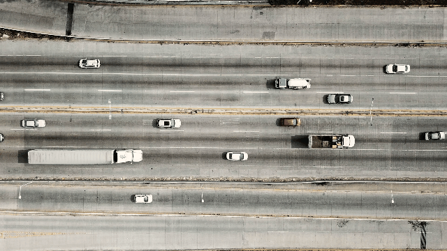
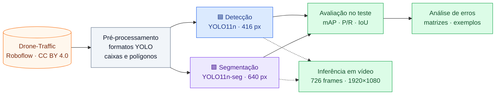
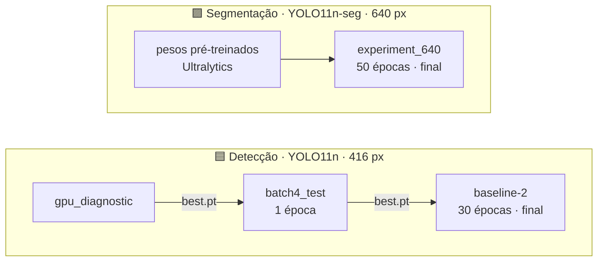
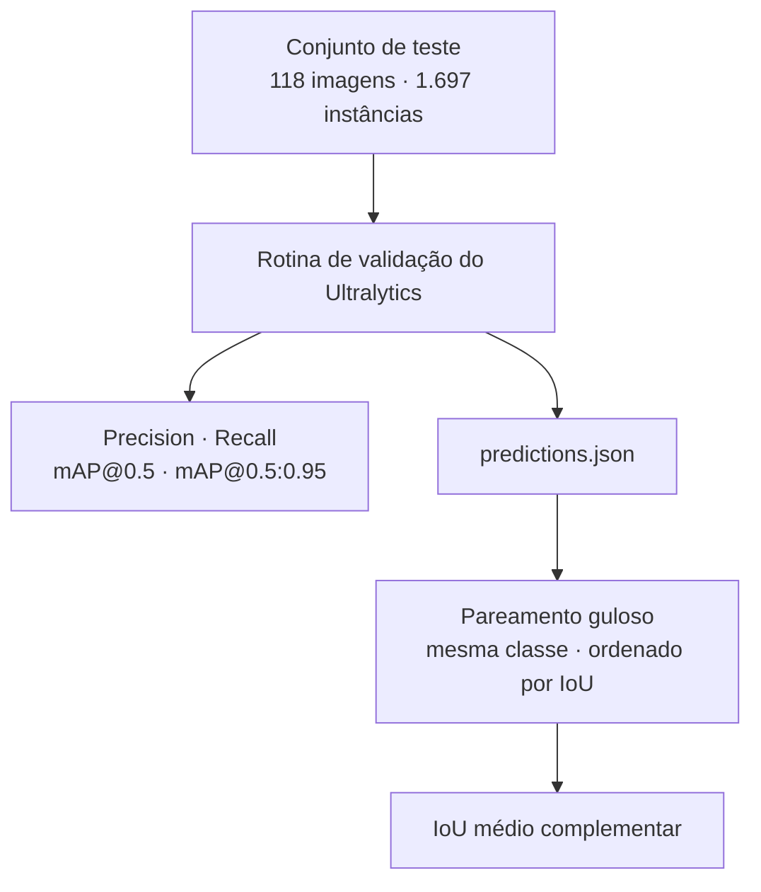
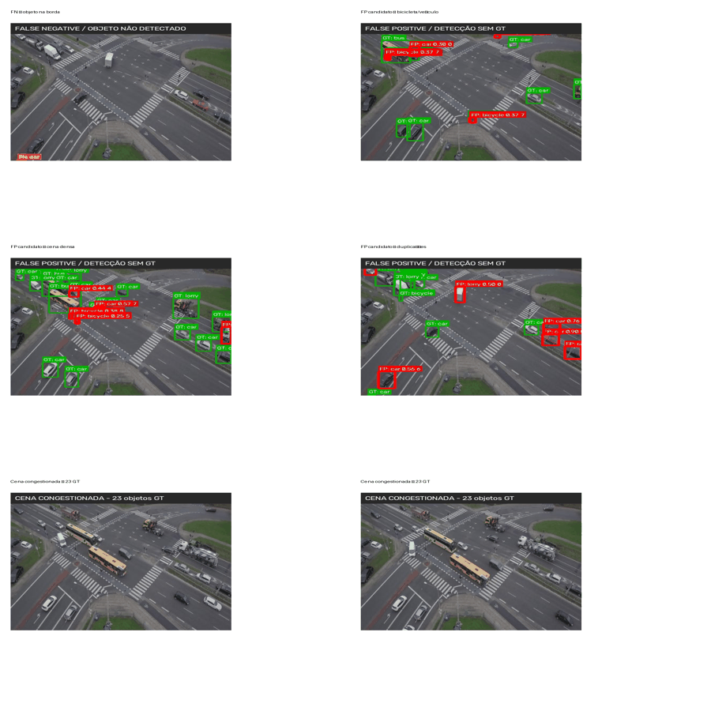
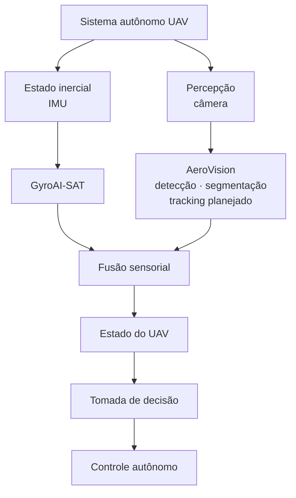

<div align="center">


<br>

[](https://www.python.org/)
[](https://pytorch.org/)
[](https://docs.ultralytics.com/)
[](https://opencv.org/)
[](LICENSE)
[](https://universe.roboflow.com/kagglemtid/drone-traffic)
[](#-sobre-o-projeto)
**Pós-graduação · Visão Computacional e Reconhecimento de Padrões**

[Resultados](#resultados) ·
[Análise de erros](#analise-de-erros) ·
[Vídeo](#video) ·
[Como reproduzir](#reproduzir) ·
[Limitações](#limitacoes) ·
[Roadmap](#roadmap)
</div>

---

## Em resumo
| Detecção<br>mAP@0.5 | Segmentação<br>mAP@0.5 (máscaras) | mAP@0.5:0.95<br>caixas · máscaras | Classe mais difícil |
| :---: | :---: | :---: | :---: |
| **0,947** | **0,981** | **0,760** · **0,725** | `bicycle` |

O **AeroVision** detecta e segmenta veículos (`bicycle`, `bus`, `car`, `lorry`) em imagens aéreas de tráfego capturadas por drone. Dois modelos da família **YOLO11** (Ultralytics) foram ajustados sobre o dataset público **Drone-Traffic**, avaliados em um conjunto de teste separado e aplicados a um vídeo real.

> [!NOTE]
Todas as imagens do dataset vêm de **uma única cena** (câmera fixa sobre um cruzamento). Os números acima descrevem o desempenho **nessa cena**, não em qualquer imagem aérea. Veja [Limitações](#limitacoes).

---

## Demonstração
<div align="center">



</div>

<!-- substitir assets/demo.gif pelo GIF real: python scripts/make_demo_gif.py --video <video> --out assets/demo.gif -->

| Recurso | Link |
| --- | --- |
| Vídeo-pitch (5 a 8 min) | **[PREENCHER: link]** |
| Vídeo com a inferência | **[PREENCHER: link]** |
| Relatório técnico | [`docs/report.pdf`](docs/report.pdf) |

---

<a id="sobre-o-projeto"></a>

## Sobre o projeto

Monitorar tráfego por drone gera um volume de imagens grande demais para análise manual. Este projeto explora duas tarefas complementares de visão computacional:

- 🟦 **Detecção de objetos:** localiza e classifica cada veículo com uma caixa delimitadora.

- 🟪 **Segmentação de instâncias:** delimita os pixels de cada veículo, dando forma e área e ajudando a separar veículos próximos.

O sistema foi desenvolvido para a disciplina de **Visão Computacional e Reconhecimento de Padrões** (cenário: análise de tráfego urbano), com avaliação por mAP, Precision, Recall, IoU, matrizes de confusão e análise de erros.

### Visão geral do pipeline


---

## Dataset
**Drone-Traffic**, do Roboflow Universe, licença **CC BY 4.0**: <https://universe.roboflow.com/kagglemtid/drone-traffic>. Todas as imagens (416 × 416) têm anotações de segmentação (polígonos); as caixas da detecção estão no formato YOLO.

| Divisão | Imagens | `bicycle` | `bus` | `car` | `lorry` | Anotações | Anot./imagem |
| --- | ---: | ---: | ---: | ---: | ---: | ---: | ---: |
| Treino | 950 | 796 | 859 | 9.410 | 3.164 | 14.229 | 15,0 |
| Validação | 251 | 226 | 249 | 2.501 | 863 | 3.839 | 15,3 |
| Teste | 118 | 101 | 116 | 1.100 | 380 | 1.697 | 14,4 |
| **Total** | **1.319** | **1.123** | **1.224** | **13.011** | **4.407** | **19.765** | **15,0** |

<div align="center">


</div>

- O conjunto é dominado por `car` (65,8%); `bus` (6,2%) e `bicycle` (5,7%) são minoritárias.

- Verificação de duplicatas exatas por hash MD5: nenhuma encontrada nas 1.319 imagens.

---

<a id="modelos"></a>

## Modelos

| | 🟦 Detecção | 🟪 Segmentação |
| --- | --- | --- |
| Modelo | YOLO11n | YOLO11n-seg |
| Pesos iniciais | `best.pt` do experimento `batch4_test` | pré-treinados (Ultralytics) |
| Tamanho da imagem | 416 × 416 | 640 × 640 |
| Épocas | 30 adicionais | 50 |
| Batch | 4 | 4 |
| Otimizador | automático (Ultralytics) | automático (Ultralytics) |
| **Augmentation** | padrão do Ultralytics | padrão do Ultralytics |
| Semente | 0 | 0 |
| Hardware | NVIDIA GTX 1050 Ti (4 GB) | NVIDIA GTX 1050 Ti (4 GB) |
| Experimento final | `results/detection/baseline-2/` | `results/segmentation/experiment_640/` |



> [!IMPORTANT]
A detecção e a segmentação foram treinadas com **configurações diferentes** (resolução, épocas e pesos iniciais). Diferenças entre as métricas de caixa dos dois modelos **não** devem ser atribuídas apenas à tarefa. Como as imagens têm 416 × 416, treinar a segmentação a 640 px implica ampliar as imagens (**upsampling**).

---

<a id="resultados"></a>

## Resultados

Todas as métricas desta seção vêm do **conjunto de teste** (118 imagens, 1.697 instâncias).

### Métricas globais
| Modelo | Precision | Recall | mAP@0.5 | mAP@0.5:0.95 | IoU médio¹ |
| --- | ---: | ---: | ---: | ---: | ---: |
| 🟦 YOLO11n · detecção (caixas) | 0,9265 | 0,9143 | 0,9472 | 0,7599 | 0,9082 |
| 🟪 YOLO11n-seg · caixas | 0,9913 | 0,9623 | 0,9880 | 0,8672 | n/d |
| 🟪 YOLO11n-seg · máscaras | 0,9861 | 0,9573 | 0,9813 | 0,7250 | 0,8611 |

<sub>¹ IoU complementar, calculado só sobre instâncias pareadas. Não substitui o mAP (detalhes abaixo).</sub>

### Métricas por classe
<table>

  <thead>

    <tr>

      <th rowspan="2" align="left">Classe</th>

      <th colspan="4" align="center">🟦 Detecção (caixas)</th>

      <th colspan="4" align="center">🟪 Segmentação (máscaras)</th>

    </tr>

    <tr>

      <th>P</th><th>R</th><th>AP50</th><th>AP50:95</th>

      <th>P</th><th>R</th><th>AP50</th><th>AP50:95</th>

    </tr>

  </thead>

  <tbody align="right">

    <tr><td align="left"><code>bicycle</code></td><td>0,794</td><td>0,762</td><td>0,832</td><td>0,365</td><td>0,969</td><td>0,925</td><td>0,957</td><td>0,383</td></tr>

    <tr><td align="left"><code>bus</code></td><td>0,966</td><td>0,985</td><td>0,995</td><td>0,950</td><td>0,989</td><td>0,983</td><td>0,995</td><td>0,896</td></tr>

    <tr><td align="left"><code>car</code></td><td>0,980</td><td>0,947</td><td>0,972</td><td>0,841</td><td>0,995</td><td>0,955</td><td>0,980</td><td>0,777</td></tr>

    <tr><td align="left"><code>lorry</code></td><td>0,966</td><td>0,963</td><td>0,990</td><td>0,883</td><td>0,992</td><td>0,966</td><td>0,993</td><td>0,845</td></tr>

  </tbody>

</table>

<div align="center">


</div>

**O que os números dizem**

- Localizar aproximadamente os veículos é fácil (mAP@0.5 acima de 0,94); acertar contornos e caixas em limiares altos de IoU é mais difícil, sobretudo nas **máscaras** (queda de 0,981 para 0,725).

- `bicycle` é a classe mais difícil nos dois modelos (AP@0.5:0.95 de 0,365 e 0,383). Na segmentação o AP@0.5 é alto (0,957), ou seja, as bicicletas são encontradas, mas com contornos pouco precisos.

- As caixas do modelo de segmentação superam as do detector, mas a comparação **não é controlada** (veja o aviso em [Modelos](#modelos)).

<details>

<summary><b>IoU médio complementar: como foi calculado e como interpretar</b></summary>

<br>

O IoU complementar usa as predições salvas em `predictions.json`, sem novo limiar de confiança, com **pareamento guloso**: candidatos de mesma classe são ordenados pela sobreposição e associados progressivamente, cada predição e cada anotação no máximo uma vez. Na segmentação o pareamento é ordenado pelo IoU das caixas e o IoU das máscaras é calculado nos pares formados.



| Classe | Detecção (caixas) | Segmentação (máscaras) |
| --- | ---: | ---: |
| `bicycle` | 0,7249 | 0,6822 |
| `bus` | 0,9630 | 0,9222 |
| `car` | 0,9107 | 0,8592 |
| `lorry` | 0,9328 | 0,8955 |
| Média simples | 0,8829 | 0,8398 |
| **Média global** (ponderada pelas instâncias) | **0,9082** | **0,8611** |

- Quase todas as anotações têm par: 1.690 de 1.697 (detecção) e 1.695 de 1.697 (segmentação).

- Como os candidatos são ordenados por IoU (e não por confiança), o valor tende a ser **otimista**, e falsos positivos não entram no cálculo. Use-o como medida de qualidade de localização, junto com Precision, Recall e mAP.

</details>

---

<a id="analise-de-erros"></a>

## Análise de erros

### Matrizes de confusão
<div align="center">


</div>

> [!WARNING]
Estas matrizes foram geradas na **validação** (as colunas somam 226, 249, 2.501 e 863 instâncias), não no teste. Não são diretamente comparáveis com as métricas por classe da seção anterior.

| Classe | Instâncias | Det. FN | Det. FP | Seg. FN | Seg. FP |
| --- | ---: | ---: | ---: | ---: | ---: |
| `bicycle` | 226 | 23 (10,2%) | 91 (54,8%) | 7 (3,1%) | 49 (45,4%) |
| `bus` | 249 | 0 | 3 (1,8%) | 2 (0,8%) | 1 (0,9%) |
| `car` | 2.501 | 66 (2,6%) | 44 (26,5%) | 42 (1,7%) | 42 (38,9%) |
| `lorry` | 863 | 10 (1,2%) | 28 (16,9%) | 9 (1,0%) | 16 (14,8%) |
| **Total** | 3.839 | **99** | **166** | **60** | **108** |

<sub>FN: instâncias reais não detectadas (fração da classe). FP: detecções sem objeto correspondente (parcela do total de FP).</sub>

- **Quase não há confusão entre classes:** a detecção tem só 9 confusões (5 `lorry` como `car`, 3 `car` como `lorry`, 1 `bus` como `bicycle`) e a segmentação, nenhuma. A dificuldade está em **encontrar** os veículos, não em distinguir tipos.

- `bicycle` concentra as perdas (10,2% na detecção) e a maior parcela dos falsos positivos.

### Exemplos qualitativos (teste)
<div align="center">


</div>

<sub><b>Legenda:</b> verde = anotação de referência · vermelho = candidato a falso positivo (confiança &gt; 0,25) · laranja = falso negativo. (a) FN junto à borda inferior esquerda · (b) candidatos de alta confiança sobre veículos sem caixa de referência · (c) `bicycle` no canto superior esquerdo · (d) candidato na extremidade de um ônibus já anotado · (e) candidatos de baixa confiança em região densa · (f) cena densa (23 anotações).</sub>

- **Vários "falsos positivos" de alta confiança parecem ser veículos reais sem anotação** (fila de carros à direita, caminhão no centro do cruzamento). Se confirmado, parte dos FP é omissão de anotação, e Precision e AP estariam subestimados.

- Nos exemplos em que a marcação é visível, o falso negativo é uma anotação pequena **junto à borda da imagem**, onde o veículo está cortado.

<details>

<summary><b>Ver os exemplos em sequência (GIF)</b></summary>

<br>

<div align="center">



</div>

</details>

---

<a id="video"></a>

## Inferência em vídeo

| | Original | Processado |
| --- | --- | --- |
| Frames | 726 | 726 |
| Duração | ≈ 30,28 s | ≈ 31,57 s |
| Taxa de quadros | 23,98 FPS | 23 FPS |
| Resolução | 1920 × 1080 | 1920 × 1080 |

- Original: `videos/traffic_drone.mp4` · Processados: `results/video/`

- O vídeo é uma **demonstração qualitativa**: não tem anotações, então nenhuma métrica é calculada sobre ele. Também não há medição controlada de FPS de inferência.

- A resolução do vídeo (1920 × 1080) difere da das imagens de treino (416 × 416).

---

<a id="reproduzir"></a>

## Como reproduzir

### 1. Instalação
```bash

git clone https://github.com/el-pitchula/AeroVision.git

cd AeroVision

python -m venv .venv

# Windows

.venv\Scripts\activate

# Linux / macOS

source .venv/bin/activate

pip install -r requirements.txt

```

### 2. Dados
Baixe o **Drone-Traffic** no formato YOLO (segmentação) em <https://universe.roboflow.com/kagglemtid/drone-traffic> e coloque em `data/`. Instruções em [`data/README.md`](data/README.md).

### 3. Treino, avaliação e inferência
O fluxo oficial está nos notebooks. Os comandos abaixo são equivalentes pela linha de comando do Ultralytics (ajuste caminhos e pesos; os resultados podem variar um pouco com hardware e não determinismo da GPU).

```bash

# Segmentação (experimento final)

yolo segment train model=yolo11n-seg.pt data=configs/aerovision_segmentation.yaml \\

     imgsz=640 batch=4 epochs=50 seed=0

# Detecção (etapa final: continuação a partir de um checkpoint anterior)

yolo detect train model=results/detection/batch4_test/weights/best.pt \\

     data=configs/aerovision_detection.yaml imgsz=416 batch=4 epochs=30 seed=0

# Avaliação no conjunto de teste

yolo val model=<pesos>.pt data=configs/<arquivo>.yaml split=test imgsz=<416 ou 640>

# Inferência em vídeo

yolo predict model=<pesos>.pt source=videos/traffic_drone.mp4 imgsz=640 save=True

```

### 4. Notebooks
| Notebook | Conteúdo | Colab |
| --- | --- | --- |
| `01_dataset_eda.ipynb` | Análise exploratória | [](https://colab.research.google.com/github/el-pitchula/AeroVision/blob/main/notebooks/01_dataset_eda.ipynb) |
| `02_preprocessing.ipynb` | Preparação dos dados | [](https://colab.research.google.com/github/el-pitchula/AeroVision/blob/main/notebooks/02_preprocessing.ipynb) |
| `03_detection.ipynb` | Treino e avaliação da detecção | [](https://colab.research.google.com/github/el-pitchula/AeroVision/blob/main/notebooks/03_detection.ipynb) |
| `04_segmentation.ipynb` | Treino e avaliação da segmentação | [](https://colab.research.google.com/github/el-pitchula/AeroVision/blob/main/notebooks/04_segmentation.ipynb) |
| `05_video_tracking.ipynb` | Inferência em vídeo | [](https://colab.research.google.com/github/el-pitchula/AeroVision/blob/main/notebooks/05_video_tracking.ipynb) |

### 5. Gerar o GIF de demonstração
```bash

python scripts/make_demo_gif.py --video results/video/<pasta>/<arquivo>.avi \\

       --out assets/demo.gif --start 5 --duration 6 --fps 8 --width 640

```

Também é possível rodar o modelo direto sobre o vídeo original com `--weights <pesos>.pt` (requer Ultralytics). Veja `python scripts/make_demo_gif.py --help`.

---

<details>

<summary><b>Estrutura do repositório</b></summary>

```text

AeroVision/

├── README.md

├── LICENSE

├── requirements.txt

├── assets/                  # imagens e GIFs deste README

├── configs/                 # YAML de detecção e segmentação

├── data/                    # instruções para obter o dataset

├── docs/                    # proposta, metodologia, referências e relatório

├── notebooks/               # 01 a 05: EDA, pré-processamento, treino, vídeo

├── scripts/

│   └── make_demo_gif.py     # gera assets/demo.gif

├── src/

│   ├── preprocessing/

│   ├── detection/

│   ├── segmentation/

│   ├── evaluation/

│   └── tracking/            # planejado (ainda não implementado)

├── models/                  # instruções para obter os pesos

├── results/

│   ├── detection/

│   ├── segmentation/

│   ├── evaluation/

│   └── video/

└── videos/                  # vídeo de entrada

```

</details>

---

<a id="limitacoes"></a>

## Limitações

- **Cena única.** Os nomes de arquivo (`seq3-drone_XXXXXXX`) e o aspecto das imagens indicam quadros de uma mesma sequência, com câmera fixa sobre um cruzamento. Quadros de validação e de teste se intercalam na numeração, então **quadros vizinhos provavelmente estão em divisões diferentes** (a verificação por MD5 só detecta duplicatas exatas). As métricas são otimistas para essa cena e não medem generalização para outros locais.

- **Teste pequeno:** 118 imagens (101 instâncias de `bicycle`, 116 de `bus`), com uma única execução de cada treino e sem intervalo de confiança.

- **Comparação não controlada** entre detecção e segmentação (resolução, épocas e pesos iniciais diferentes).

- **Anotação de referência** com possíveis omissões de veículos, o que subestima Precision e AP.

- Modelos compactos (variante **nano**) e imagens de 416 × 416, o que limita objetos pequenos como `bicycle`.

- Um único vídeo, avaliado só qualitativamente, e sem rastreamento de veículos.

---

<a id="roadmap"></a>

## Roadmap

- [ ] Rastreamento de veículos (por exemplo, ByteTrack) e contagem por trajetória

- [ ] Comparação controlada entre detecção e segmentação (mesma resolução, épocas e pesos), com várias sementes

- [ ] Técnicas para objetos pequenos: maior resolução, modelos maiores, inferência por recortes

- [ ] Novos dados: outras cenas, altitudes, iluminação e clima, e vídeos anotados

- [ ] Demo interativa (Gradio / Hugging Face Spaces)

- [ ] Integração com dados inerciais (IMU) e com o projeto GyroAI-SAT **(direção de longo prazo)**

<details>

<summary><b>Arquitetura de longo prazo (fora da avaliação atual)</b></summary>

<br>

O AeroVision seria o módulo de percepção visual de um sistema autônomo de UAV. A integração com sensores inerciais **não faz parte** deste trabalho.



</details>

---

## Licença e atribuição
- **Código:** licença MIT (arquivo [`LICENSE`](LICENSE)).

- **Dataset:** **Drone-Traffic**, de terceiros, sob **CC BY 4.0**: <https://universe.roboflow.com/kagglemtid/drone-traffic>. As imagens usadas no banner e nos exemplos deste README vêm desse dataset.

- **Modelos base:** Ultralytics YOLO11, sob a licença da própria Ultralytics.

## Referências e como citar
1. Jocher, G.; Qiu, J. **Ultralytics YOLO11**. 2024. <https://github.com/ultralytics/ultralytics>

2. Redmon, J. et al. **You Only Look Once: Unified, Real-Time Object Detection**. CVPR, 2016.

3. Lin, T.-Y. et al. **Microsoft COCO: Common Objects in Context**. ECCV, 2014.

4. kagglemtid. **Drone-Traffic**. Roboflow Universe. <https://universe.roboflow.com/kagglemtid/drone-traffic>

<details>

<summary><b>BibTeX</b></summary>

```bibtex

@misc{aerovision2026,

  title        = {AeroVision: Sistema de Percepção Visual para Detecção e Segmentação de Objetos em Imagens Aéreas},

  author       = {Gabrielly, Jaysa},

  year         = {2026},

  howpublished = {\url{https://github.com/el-pitchula/AeroVision}},

  note         = {Trabalho da disciplina de Visão Computacional e Reconhecimento de Padrões}

}

```

</details>

<div align="center">

<sub>Feito com 🐍 Python · 🔥 PyTorch · 🟦 Ultralytics YOLO11</sub>

</div>
